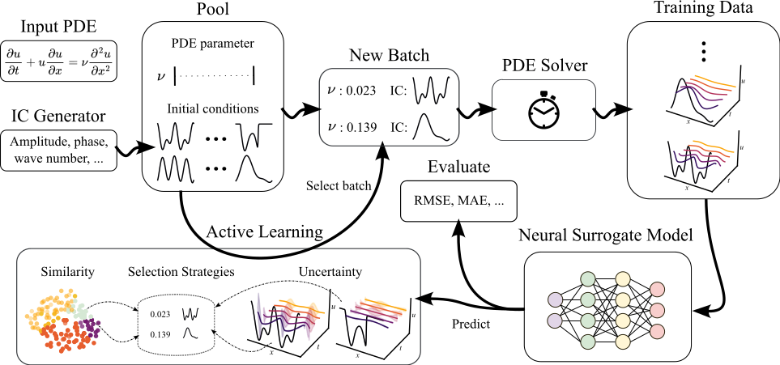

# AL4PDE: A Benchmark for Active Learning for Neural PDE Solvers 

This repository contains the code for the paper **[Active Learning for Neural PDE Solvers](https://arxiv.org/abs/2408.01536)** (AL4PDE), introducing a modular and extensible active learning benchmark for time-dependent parametric PDE solving and comprises active learning algorithms, numerical solvers of parametric PDEs, and state-of-the-art neural PDE solvers.




# Installation 

```shell
conda config --set channel_priority flexible
conda env create -n al4pde -f environment.yml
```


### Alternative step-by-step installation

```shell
# install mamba; if you already have it, skip this
wget -c https://github.com/conda-forge/miniforge/releases/latest/download/Miniforge3-Linux-x86_64.sh
bash Miniforge3-Linux-x86_64.sh

# create a mamba env for the project
mamba create -n al4pde python=3.10
mamba activate al4pde
mamba install pytorch torchvision torchaudio pytorch-cuda=12.1 -c pytorch -c nvidia
mamba install jaxlib=*=*cuda* jax cuda-nvcc -c conda-forge -c nvidia
# if the above jaxlib installation fails, try either of the below commands
pip install --upgrade "jax[cuda12_pip]" -f https://storage.googleapis.com/jax-releases/jax_cuda_releases.html
pip install https://storage.googleapis.com/jax-releases/cuda12/jaxlib-0.4.26+cuda12.cudnn89-cp310-cp310-manylinux2014_x86_64.whl

pip install matplotlib seaborn submitit hydra-core wandb h5py pyvista bmdal_reg lightning # otherwise matplotlib wants to downgrade jax to cpu
pip install hydra-submitit-launcher --upgrade

mamba  install -c conda-forge tensordict seaborn

# install jax-cfd-0.2.0 locally
git clone https://github.com/google/jax-cfd.git
cd jax-cfd
git checkout -b new_branch d215f13
pip install -e ".[complete]"

# install pdearena and associated packages
git clone https://github.com/microsoft/pdearena
cd pdearena
pip install -e .
pip install -e ".[datagen]"

pip install "cliffordlayers @ git+https://github.com/microsoft/cliffordlayers"
```

# Running Experiments

Before running any experiments, the ground truth data has to be generated using gen_data. The option task.use_test=True lets the evaluation switch to the test data for the final evaluation.
```shell
# add your user info for wandb
wandb login    # authenticate using your API key by grabbing it from https://wandb.ai/authorize

# first, generate data
python -m scripts.gen_data --m task=burgers,ks_l_v_ic,2d_ns_rand,ce_no_forcing hydra=submitit

# then, run active learning
python -m scripts.al_submitit --m +experiment=ks  +experiment/sub_exp=power
```

## Paper experiments
All the different experiments from the paper have their own config file. 
To reproduce the main experiments:
```shell
# Or experiment=ce_no_forcing/burgers/2dcfd
# Or sub_exp=random/ll_mean(LCMD)/maxdist_ll_mean(Coreset)/topk
python -m scripts.al_submitit --m +experiment=ks  +experiment/sub_exp=power seed=0,1,2,3,4
```
For Burgers, seeds 0-9 were used.
## Configuring Experiments
We use hydra to configure all experiments. The 'config' folder contains the modular configuration,
which represents the code structure. 
- 'main.yaml': contains the starting point of the configuration.
- experiment: contains the changes to the defaults for a specific experiment from the paper
- sub_exp: contains the changes to the defaults for a specific method

To add a new experiment, it is the easiest to add a new file in experiment, and then call it using the example 
code above (replace ks_val in the example with the name of the new config file).

# Framework Overview

AL4PDE consists of three main parts: the PDE and simulator specific information in **Task**, the  neural PDE solver and finally the AL algorithms themselves.

Simulator and input generation:
- **Task**
  - Contains all PDE specific information
  - Keeps **PDEParamGenerator**, **ICGenerator** and **Simulator**
- **PDEParamGenerator** 
  - Generates a batch of PDE parameters
- **ICGenerator**
  - Generates a batch of ICs
- **Simulator**
  - Evolves a batch of ICS and PDEParameters

Surrogate Training:
- **Model**
  - Wraps the actual pytorch module
  - Provides interface for rollouts, forward, as well as train and test
- **ProbModel**
  - Subclass of **Model**, adds interface for uncertainty estimates (unc_rollout)
- **Module**
  - Contains the pytorch modules such as FNO


AL algorithms:
- **BatchSelection**
  - Generates the next batch of samples using a **Model** and **Task**


## How to add a new Model?
A new model can be added by deriving a subclass from the **Model** base class. In the simplest case, this can be done by implementing the call to the pytorch module in the **forward()** method (see **ArenaWrapper**). Alternatively, a different training procedure can be implemented by overwriting **train_single_epoch()**.

## How to add a new AL algorithm?
A new AL algorithm can be implemented by overwriting the **BatchSelection** class from the **acquisition** package. For pool-based methods, the class **PoolBased** can be overwritten, where a specific method can implement the **select_next()** method, which just has to return the index of the samples to select from the pool. 
## How to add a new PDE?
For a new PDE, a new subclass of **Simulator** has to be added, and the **n_step_sim()** method should be overwritten. In general, the **PDEParamGenerator** class can be configured to produce any simple, (log-) uniform distribution of PDE parameters. For a new IC generator, implement a subclass of the **ICGenerator** class. Here, the **_initialize_ic_params()** and **generate_initial_conditions()** methods have to be overwritten. All randomness should be contained in **_initialize_ic_params()** (for example sample the random amplitude in **_initialize_ic_params()**, and then transform them deterministically in **generate_initial_conditions()** to the true IC).


